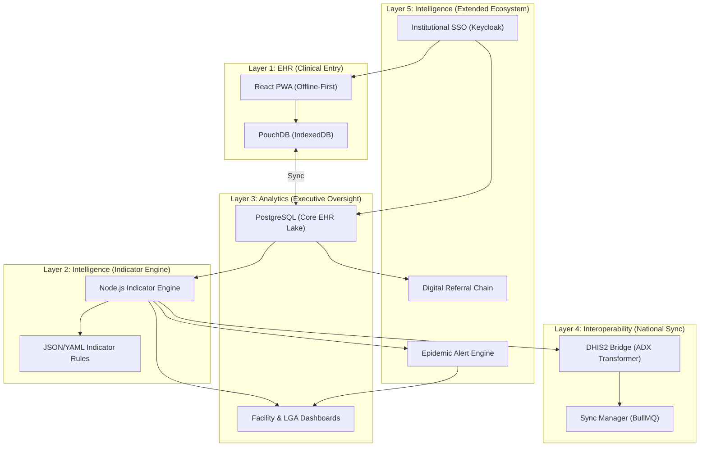

# CareLink PHC: Digital Public Health Infrastructure
## Comprehensive Technical White Paper | Version 1.1 (February 2026)

---

### 1. Executive Summary
CareLink PHC is a world-class, purpose-built Digital Health solution designed to eliminate the inefficiencies of manual health management in Primary Health Care (PHC) facilities. It bridges the gap between point-of-care clinical workflows and state-level strategic decision-making through a 4-layer architectural model that automates National Health Management Information System (NHMIS) reporting.

---

### 2. Architectural Blueprint
The system follows a strictly decoupled, layered architecture to ensure modularity, scalability, and ease of maintenance.

---

### 3. Deep-Dive: Service Modules
CareLink PHC implements four mission-critical clinical modules, each meticulously aligned with NHMIS Version 2023+ standards.

| Module | Focus Area | Key Data Points | Impact |
| :--- | :--- | :--- | :--- |
| **OPD** | Outpatient Dept | ICD-10 Diagnosis, Morbidity, Vitals | Epidemic monitoring |
| **ANC** | Antenatal Care | Visit Number, BP, Weight, Fetal heart rate | Maternal mortality reduction |
| **IMM** | Immunization | PENTA, BCG, OPV, Vitamin A | Child survival rates |
| **NCD** | Chronic Disease | HTN, Diabetes tracking, Medication adherence | Longitudinal care |

---

### 4. Technical Specifications

#### 4.1 Offline-First Synchronization
To excel in environments with intermittent connectivity, CareLink utilizes a "Couch-Pouch" synchronization protocol:
- **Local Persistence**: Data is written to `PouchDB` (IndexedDB) with millisecond latency.
- **Bi-directional Sync**: When online, the client initiates a sync with the `CouchDB` gateway.
- **Master Lake**: Data is eventually aggregated in a `PostgreSQL` instance for complex analytical queries.

#### 4.2 The Indicator Engine
The **Indicator Engine** is the brain of the system. It uses a non-destructive processing model:
- **Rule Engine**: Indicators like `ANC COVERAGE` or `MALARIA TREND` are defined as computational rules.
- **Aggregation**: It processes thousands of individual clinical encounters in sub-seconds to produce LGA-level summaries.
- **Data Dictionary**:
    - `ANC_COVERAGE`: `(Encounters[service=ANC, visit=1] / Target_Population) * 100`
    - `MORBIDITY_PROFILE`: Grouping of ICD-10 codes by frequency per facility.

#### 4.3 DHIS2 Interoperability (Layer 4)
Interoperability is achieved via the `DHIS2 Bridge`:
- **ADX Transformer**: Converts JSON indicators into standard `XML-ADX` format.
- **Sync Manager**: A persistent queue that handles retries and back-off strategies, ensuring data reaches the National Instance even on poor 3G networks.

---

### 5. Security, Governance & Compliance
A "Security-by-Design" approach ensures the protection of sensitive patient PII.

*   **AES-256 Encryption**: Data at rest in both local and central databases is encrypted.
*   **Centralized Audit Trails**: The `auditLogger` middleware captures:
    - Actor ID (Who)
    - Timestamp (When)
    - Resource URL (What)
    - Delta (Modification details)
*   **Infrastructure Hardening**:
    - **Containerization**: Single-command orchestration via `Docker Compose`.
    - **Nginx Protection**: Reverse proxy with Gzip compression and security headers (`X-Frame-Options`, `CSP`).
    - **Environment Segregation**: Standardized `.env` schema for secure credential management.
*   **RBAC & MFA**: Integrated Keycloak SSO provides role-based access control and multi-factor authentication for data entry clerks and administrators.
*   **Data Sovereignty**: The State Ministry of Health retains full ownership. All data resides in localized infrastructure within state borders.

---

### 6. Implementation Roadmap

| Phase | Milestone | Deliverables | Status |
| :--- | :--- | :--- | :--- |
| **Phase 1** | Core Clinical | EHR Modules (OPD, ANC, IMM, NCD) | ✅ COMPLETED |
| **Phase 2** | Intelligence | Indicator Engine, Facility Dashboards | ✅ COMPLETED |
| **Phase 3** | Hardening | Security Audit, DHIS2 Bridge, Load Tests | ✅ COMPLETED |
| **Phase 4** | Scale | CI/CD, Lab/Pharmacy Modules, Training SOP | ✅ COMPLETED |
| **Phase 5** | Intelligence| Epidemic Alerting, Referrals, OIDC SSO | ✅ COMPLETED |
| **Phase 6** | Infrastructure| Docker, Nginx Hardening, Env Security | ✅ COMPLETED |

---

### 7. Future Horizons (Phase 4 & Beyond)
- **ML-Driven Outbreak Detection**: Early warning systems that detect morbidity spikes before they reach crisis proportions.
- **Resource Management (LMIS)**: Integration with drug procurement data to match clinical needs with medical supply chain availability.
- **Telemedicine Integration**: Enabling remote specialist consultation for Primary Care providers via the CareLink platform.

---
**Standard**: ISO/TC 215 Medical Informatics | HL7 FHIR Allied
**Produced by**: Antigravity Technical Engineering Team
