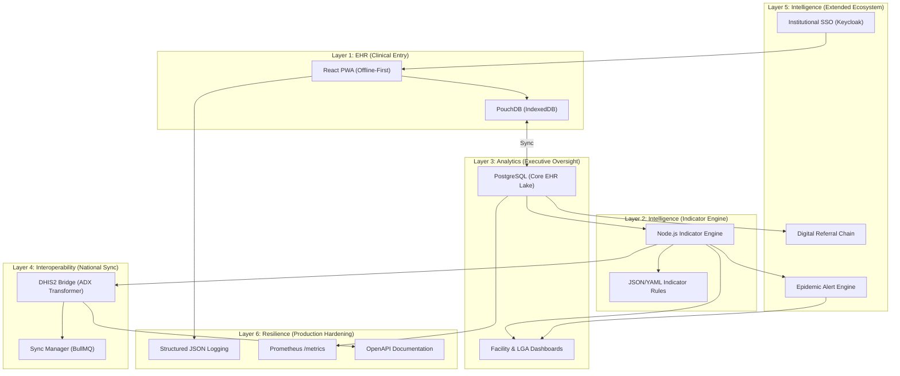

# CareLink PHC: Digital Public Health Infrastructure

## Comprehensive Technical White Paper | Version 1.2 (March 2026)

---

### 1. Executive Summary

CareLink PHC is a world-class, purpose-built Digital Health solution designed to eliminate the inefficiencies of manual health management in Primary Health Care (PHC) facilities. It bridges the gap between point-of-care clinical workflows and state-level strategic decision-making through a 4-layer architectural model that automates National Health Management Information System (NHMIS) reporting.

---

### 2. Architectural Blueprint

The system follows a strictly decoupled, layered architecture to ensure modularity, scalability, and ease of maintenance.

---

### 3. Deep-Dive: Service Modules

CareLink PHC implements four mission-critical clinical modules, each meticulously aligned with NHMIS Version 2023+ standards.

| Module | Focus Area | Key Data Points | Impact |
| :--- | :--- | :--- | :--- |
| **OPD** | Outpatient Dept | ICD-10 Diagnosis, Morbidity, Vitals | Epidemic monitoring |
| **ANC** | Antenatal Care | Visit Number, BP, Weight, Fetal heart rate | Maternal mortality reduction |
| **IMM** | Immunization | PENTA, BCG, OPV, Vitamin A | Child survival rates |
| **NCD** | Chronic Disease | HTN, Diabetes tracking, Medication adherence | Longitudinal care |

---

### 4. Technical Specifications

#### 4.1 Offline-First Synchronization

To excel in environments with intermittent connectivity, CareLink utilizes a "Couch-Pouch" synchronization protocol:

- **Local Persistence**: Data is written to `PouchDB` (IndexedDB) with millisecond latency.
- **Bi-directional Sync**: When online, the client initiates a sync with the `CouchDB` gateway.
- **Master Lake**: Data is eventually aggregated in a `PostgreSQL` instance for complex analytical queries.

#### 4.2 The Indicator Engine

The **Indicator Engine** is the brain of the system. It uses a non-destructive processing model:

- **Rule Engine**: Indicators like `ANC COVERAGE` or `MALARIA TREND` are defined as computational rules.
- **Aggregation**: It processes thousands of individual clinical encounters in sub-seconds to produce LGA-level summaries.
- **Data Dictionary**:
  - `ANC_COVERAGE`: `(Encounters[service=ANC, visit=1] / Target_Population) * 100`
  - `MORBIDITY_PROFILE`: Grouping of ICD-10 codes by frequency per facility.

#### 4.3 DHIS2 Interoperability (Layer 4)

Interoperability is achieved via the `DHIS2 Bridge`:

- **Sync Manager**: A persistent queue that handles retries and back-off strategies, ensuring data reaches the National Instance even on poor 3G networks.

#### 4.4 Integrated Logistics (LMIS)

The system bridges clinical activity with supply chain management:

- **AMC Forecasting**: Automatically calculates **Average Monthly Consumption** from dispensed prescriptions.
- **Atomic Synchronization**: Stock levels are decremented in real-time within the clinical data lake during pharmacy fulfillment.
- **Stock-Out Prevention**: Integrated alerts for "Months of Stock" (MOS) falling below critical safety thresholds.

#### 4.5 Community & GIS Intelligence

Extending CareLink PHC from the facility into the household:

- **Mobility First**: Offline-first CHV mobile tools allow for household registration and symptom screening in the field.
- **Geospatial Analytics**: Built-in GIS engine for real-time visualization of morbidity patterns vs. clinical logistics.
- **Community Referral Loop**: Automated tracking of patients referred from the community to the facility level.

---

---

### 5. Security, Governance & Compliance

A "Security-by-Design" approach ensures the protection of sensitive patient PII.

---

### 6. Implementation Roadmap

| Phase | Milestone | Deliverables | Status |
| :--- | :--- | :--- | :--- |
| **Phase 1** | Core Clinical | EHR Modules (OPD, ANC, IMM, NCD) | ✅ COMPLETED |
| **Phase 2** | Intelligence | Indicator Engine, Facility Dashboards | ✅ COMPLETED |
| **Phase 3** | Hardening | Security Audit, DHIS2 Bridge, Load Tests | ✅ COMPLETED |
| **Phase 4** | Scale | CI/CD, Lab/Pharmacy Modules, Training SOP | ✅ COMPLETED |
| **Phase 5** | Intelligence| Epidemic Alerting, Referrals, OIDC SSO | ✅ COMPLETED |
| **Phase 6** | Infrastructure| Docker, Nginx Hardening, Env Security | ✅ COMPLETED |
| **Phase 7** | Logistics| LMIS Integration, Longitudinal Timeline | ✅ COMPLETED |
| **Phase 8** | Spatial | CHV Mobile Hub, GIS Heatmapping | ✅ COMPLETED |
| **Phase 9** | Reliability | CI Stabilization, Secret Scrubbing | ✅ COMPLETED |
| **Phase 10** | Cloud Scale | Vercel Deployment, Serverless Adapters | ✅ COMPLETED |
| **Phase 11** | Proactive | AI Forecasting, NEWS2 Alerts | ✅ COMPLETED |
| **Phase 12** | Resilient | Hardening, Observability, Swagger | ✅ COMPLETED |

---

### 7. Governance, Security & Reliability

#### 7.1 Production Hardening

- **Edge Security**: Integrated `helmet` middleware for strict CSP, XSS protection, and frameguard.
- **Rate Limiting**: Tiered rate protection across all API routes to prevent DoS/Brute-force attacks.
- **Audit Logging**: Mandatory JSON-structured audit trails for every PII-related transaction.
- **Identity Foundation**: Enterprise-grade RBAC and MFA powered by Keycloak institutional SSO.

#### 7.2 Cloud Observability

- **Prometheus Metrics**: High-granularity `/metrics` endpoint for real-time latency and throughput monitoring.
- **Log Aggregation**: Standardized Winston-driven structured logging for effortless ELK/Splunk integration.
- **Self-Healing**: Automated health diagnostics checking database connectivity and system environment health.

### 8. Future Horizons (2026+)

- **Generative Clinician Assistant**: Integration with lightweight Med-LLMs for automated discharge summary generation and clinical coding suggestions.
- **IoT Cold-Chain Monitoring**: Real-time vaccine refrigerator telemetry integrated directly into the Logistics Module.
- **State-Wide EOC Dashboard**: A command-and-control interface for the State Emergency Operations Center during outbreaks.

---
**Standard**: ISO/TC 215 Medical Informatics | HL7 FHIR Allied
**Produced by**: Antigravity Technical Engineering Team
